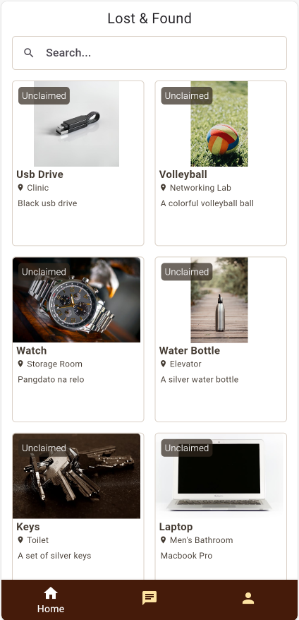

# Findr

Findr is a Flutter-based mobile application designed to help the way lost and found items are handled on your campus. This user-friendly app empowers students and staff to easily browse a list of found items and inquire about specific items through a convenient chat feature.

# Nov 22, 2024 Note:

Good afternoon, sir!

Sa database po namin, yung items lang po na may more than 1 image are: Laptop and Ipad

Itong dalawang items lang po ang ma carousel since the other items only have 1 image

# Features

* **Found Items**: A comprehensive list of found items is displayed, categorized by location and item type. Users can filter and search this list to quickly find relevant items.
* **Direct Communication**: Users can directly message the finder or reporter of an item through a built-in chat feature.
* **Secure Messaging**: The chat system ensures secure and private communication between users.

# Screenshots

### Login Page

### Dashboard

# Technology Stack

* **Flutter**: A powerful cross-platform framework for building native mobile apps.
* **Supabase**: A backend platform providing real-time database, authentication, and storage.
* **Dart**: A modern programming language used to develop Flutter apps.

